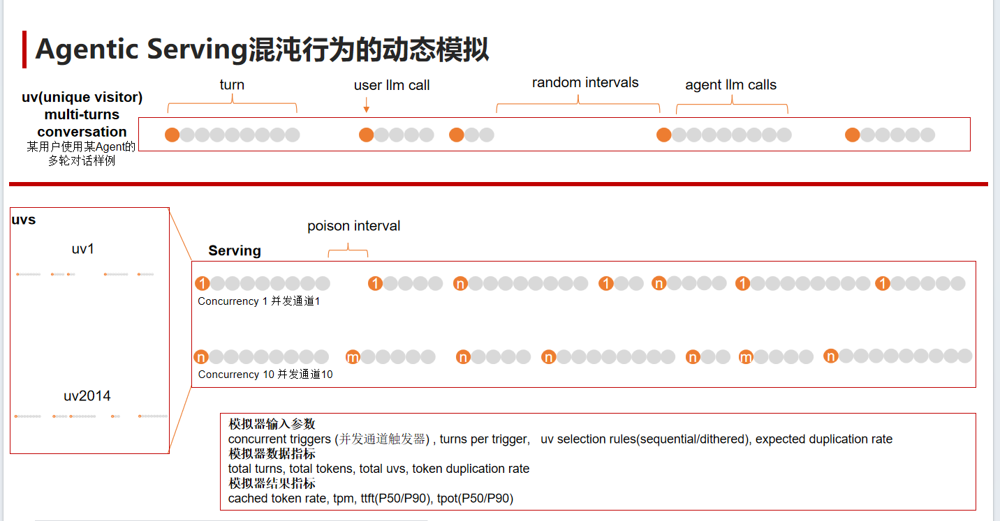

# Loadgen2

---

## 背景与动机：为什么需要 LoadGen 2.0？

### 从对话式 AI 到自主智能体

2026 年以来，随着 AI Agent（智能体）技术的全面破圈，大语言模型（LLM）正从简单的对话机器人加速演进为能够**自主规划、推理并采取行动**以达成复杂目标的**长时运行系统**。这一趋势使得大模型推理算力需求呈井喷式增长，"Token 工厂"概念跃升为行业核心焦点。

### 智能体负载的全新挑战

智能体（Agentic）的工作负载与传统人类对话交互在结构上截然不同，呈现出三大核心特征：

| 特征 | 描述 |
|---|---|
| **长周期多轮循环** | 单次任务涉及数十次推理循环、工具调用与自我反思的叠加，而非一问一答 |
| **上下文指数级膨胀 (Context Ballooning)** | 随推理深入，上下文窗口不断扩张，对 KV Cache 造成巨大压力 |
| **高频状态切换** | 在"推理阶段"（产生中间思考）与"行动阶段"（发起外部工具调用、接收结果）之间反复跳转 |

这些特征导致 **KV Cache 被频繁置换**、**轮次间隔严重抖动**，使得传统的静态压测指标完全失效。



### 传统压测工具的局限

传统的压测框架（包括 MLPerf 原版 LoadGen）擅长模拟**规整、线性的恒定流量**（如固定 QPS 的 Offline / Server 场景），但在面对智能体负载时则捉襟见肘：

- **无法模拟多轮对话的状态保持**：每次请求独立，不知道哪些请求属于同一会话
- **无法复现混沌的用户到达模式**：真实用户的行为间隔呈泊松分布，而非均匀间隔
- **无法刻画上下文膨胀效应**：传统压测看不到长对话中 context 增长对延迟和吞吐的渐进影响

### LoadGen 2.0 的核心突破

LoadGen 2.0 基于 MLPerf LoadGen 进行了深度重构，实现了从**静态并发注入**到**动态行为仿真**的跨越：

- **多轮状态保持（Stateful Turn-based）模拟**：以"会话"为最小压测单元，完整保留对话上下文链路，真实还原多轮工具调用的长周期负载
- **混合泊松分布逻辑**：通过泊松过程控制虚拟用户（VU）的到达间隔，模拟真实生产环境中交织、重叠且不可预测的计算请求
- **混沌负载能力**：能够复现 Context Ballooning 导致的渐进式性能退化，帮助开发者和运营者在上线前探明集群的性能崩溃边界与资源调度瓶颈

### 面向谁？

本工具旨在为 AI 基础设施生态的四个关键角色提供统一的评测基准：

| 角色 | 核心诉求 |
|---|---|
| **建设者** | 针对长上下文频繁复用优化架构 |
| **运营者** | 预估动态波动下的并发水位 |
| **使用者** | 获取明确的 SLA 采购依据 |
| **最终用户** | 避免"首字延迟（TTFT）不可控"和"推理中途断线" |

---

## 组件概览

 `inference/` 目录下与 **GLM-5.1** 基准测试相关的三个核心组件的编译、安装与配置方法：

1. [LoadGen](#1-loadgen) —  官方负载生成器
2. [GLM-5.1 模型](#2-glm-51-模型压测参考实现) — 模型端 MLPerf 客户端

---

## 1. LoadGen

**路径**: `inference/loadgen`

### 概述

LoadGen 是 MLPerf Inference 的**核心负载生成与测量工具**，用 C++ 编写并提供 Python 绑定。它按 MLPerf 定义的场景（Offline / Server / SingleStream 等）和模式（Performance / Accuracy / FindPeakPerformance）生成查询流量并记录结果。

## 2. GLM-5.1 模型压测参考实现

**路径**: `inference/language/glm-5.1`

### 概述

GLM-5.1 的 MLPerf Inference 参考实现，作为 **OpenAI 兼容 API 的客户端** 工作，对接外部推理服务端（如 vLLM、SGLang、GLM API 等）。**不管理服务端生命周期**，只负责发送请求并处理响应。

```
glm-5.1/
├── backends/          # 后端抽象（openai_backend.py）
├── mlperf/            # SUT、QSL、场景实现
├── utils/             # 工具（注册、数据、验证、tokenization）
├── docker/            # Docker 配置（目前为空）
├── mock_server/       # 模拟服务端（Rust）
├── run_mlperf.py      # MLPerf 基准测试入口
├── run_eval.py        # 评估入口
├── eval_accuracy.py   # 精度评估
├── setup.sh           # 一键安装脚本（基于 uv）
├── pyproject.toml     # 项目元数据与依赖声明
└── data-process.md    # 数据处理说明
```

### 安装

```
cd language/gml-5.1

# 安装所有的包， 包括 loadgen 模块
uv sync --all-extras --refresh --reinstall-package mlcommons-loadgen
```

### 配置

通过环境变量或修改 `utils/backend_registry.py`：

| 环境变量 | 用途 | 默认值 |
|---|---|---|
| `MLPERF_BACKEND` | 后端选择 | `openai` |
| `OPENAI_API_KEY` / `GLM_API_KEY` | API 密钥 | — |
| `OPENAI_API_BASE` | API 端点地址 | `http://localhost:8000/v1` |
| `model` | 模型名称 | `glm-5-1` |
| `max_tokens` | 最大输出 token 数 | 8192 |
| `temperature` | 采样温度 | 0.0 |
| `max_concurrent_requests` | 最大并发请求数 | 64 |

### 运行

```bash
cd language/glm-5.1

# split_codex_swebenchpro 数据集
# 下载将数据集解压到一个目录.
# 
uv run python scripts/split_codex_swebenchpro.py \
    --input datasets/codex_swebenchpro_format.json \
    --output-dir conversations_split


# 运行测试前，编辑 run_test_session.sh 调整以下参数：
#   OPENAI_API_BASE  → 指向你的推理服务端地址
#   OPENAI_API_KEY   → API 密钥
#   OPENAI_MODEL     → 模型名称
#   INPUT_DATA       → 预处理后的 JSON 文件路径
#   MAX_TRIGGER      → 最大并发 trigger 数（默认为 10）
#   POISSON_LAM      → 用户间泊松间隔参数（0 表示无间隔）
#   MAX_TRACE        → 限制 VU 数量（可选）
sh run_test_session.sh
```

如需更细粒度的参数控制，可以直接调用 `run_session_mlperf.py`：

```bash
uv run python run_session_mlperf.py \
    --input preprocess.json \
    --output-dir traces_mlperf_results \
    --max-trigger 10 \
    --poisson-lam 0 \
    --poisson-seed 42 \
    --time-unit s \
    --tpm-interval 60.0 \
    --plot-interval 5.0 \
    --mlperf-conf ../../mlperf.conf
```


#### Docker 运行


##### GLM5.1 数据集

```
# 需要在 inference/ 根目录下执行（build context 要包含 language/ 和 loadgen/）
cd /home/ldx/mlperf/inference
docker build -f language/glm-5.1/docker/Dockerfile -t glm-5.1-mlperf .
```


```
# 下载程序镜像， 减少GLIBC 版本不一致
curl -O http://10.188.128.16:35612/glm-5.1-mlperf.tar

# 加载镜像
docker load < glm-5.1-mlperf.tar

# 下载数据集
curl -O http://10.188.128.16:35612/glm51-dataset.zip 

unzip glm51-dataset.zip

# 查看帮助
docker run --rm glm-5.1-mlperf run_session_mlperf.py --help

# 传入数据文件运行
# 也支持 --target-qps 等新参数
docker run --rm -it \
    -v /home/ldx/loadgen/extracted_files:/data \
    -e OPENAI_API_KEY=YourKey \
    -e OPENAI_API_BASE=http://10.188.128.16:21000 \
    -e OPENAI_MODEL=YourModel \
    -e MLPERF_MAX_OSL=8192 \
    glm-5.1-mlperf run_session_mlperf.py \
        --input /data \
        --target-qps 2.0 \
        --min-duration 600 \
        --min-query-count 100 
```

环境变量
```
OPENAI_API_KEY=    # API_KEY
OPENAI_API_BASE=   # 模型请求url 前缀
OPENAI_MODEL=      # 模型名称
MLPERF_MAX_OSL=    # 要求server 输出最大token数
```

一些参数说明

```
options:
  -h, --help            show this help message and exit
  --input INPUT, -i INPUT
                        Conversation JSON file/dir
  --output-dir OUTPUT_DIR
                        Output directory for LoadGen logs
  --num-slots NUM_SLOTS
                        并发度的数量 (default 10)
  --poisson-lam POISSON_LAM
                        泊松间隔的时间期望值， 比如取60， 两个用户交互之间的间隔时间在60左右做泊松分布
  --poisson-seed POISSON_SEED
                        泊松分布随机种子
  --poisson-pool-size POISSON_POOL_SIZE
                        Number of pre-generated Poisson intervals per worker
                        (default 1000)
  --time-unit {s,ms}    Unit of ps_delta / executed_time (default s)
  --max-vu MAX_VU       从数据集里面取多少会话快照 (truncates sessions)
  --min-query-count MIN_QUERY_COUNT
                        要发生用户交互的次数(不是请求数)
  --go-to-end           Iterate all requests to conversation end (instead of
                        stopping at next user), sleeping Poisson intervals
                        between users
```


##### DeekSeek

有两个可以选的数据集, 
`mlperf_deepseek_r1_dataset_4388_fp8_eval.pkl`
和
`mlperf_deepseek_r1_calibration_dataset_500_fp8_eval.pkl`

--mode 参数可以指定 模式

```
docker run --rm -it    \
 -v $PWD/output:/output \
 -e OPENAI_API_KEY=YourKey \
 -e OPENAI_API_BASE=http://10.188.128.16:21000 \
 -e OPENAI_MODEL=Mock-Model \
 glm-5.1-mlperf  deepseek run_mlperf.py     \
 --input-file=mlperf_deepseek_r1_dataset_4388_fp8_eval.pkl \
 --output-dir /output
  --target-qps 14.72 \
  --min-duration 600000 \
  --min-query-count 105312 
```

or

```
docker run --rm -it    \
 -v $PWD/output:/output \
 -e OPENAI_API_KEY=YourKey \
 -e OPENAI_API_BASE=http://10.188.128.16:21000 \
 -e OPENAI_MODEL=Mock-Model \
 glm-5.1-mlperf  deepseek run_mlperf.py     \
 --input-file=mlperf_deepseek_r1_dataset_4388_fp8_eval.pkl \
 --output-dir /output
  --target-qps 14.72 \
  --min-duration 600000 \
  --min-query-count 105312 \
  --mode server
```
